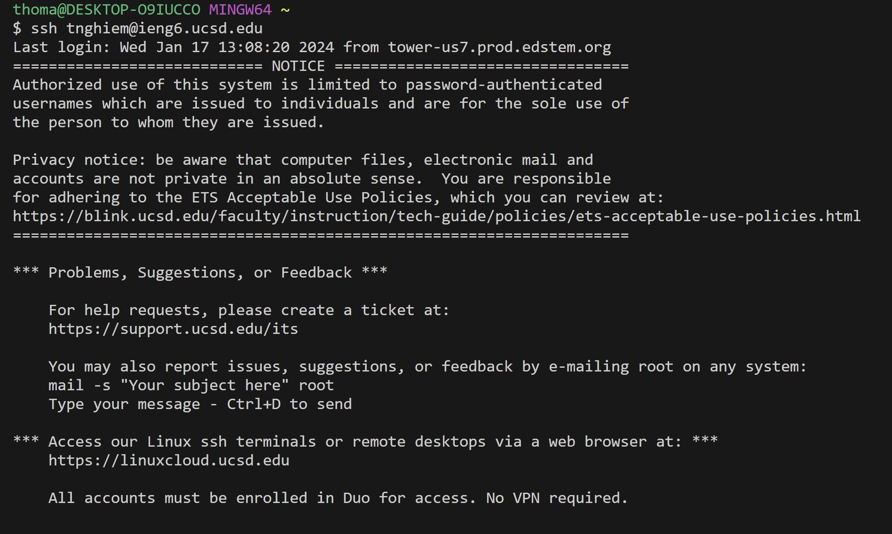
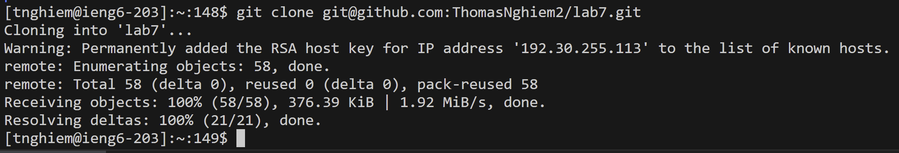
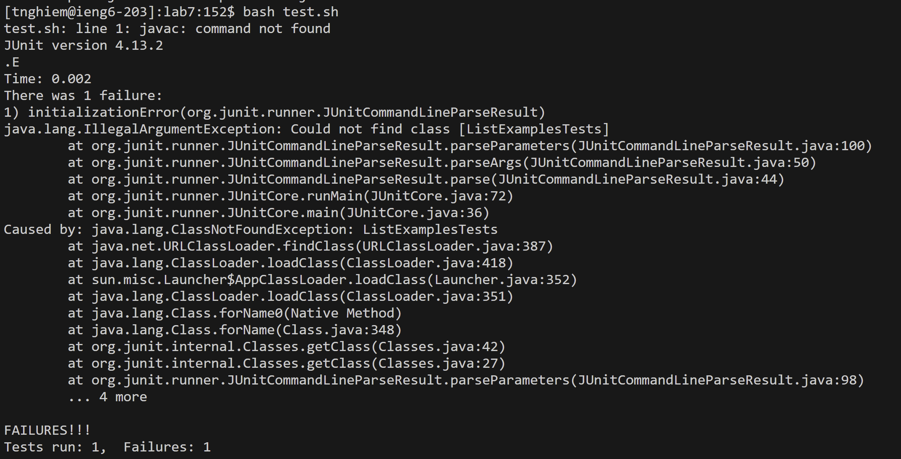
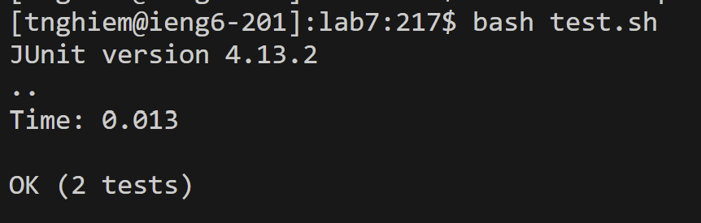
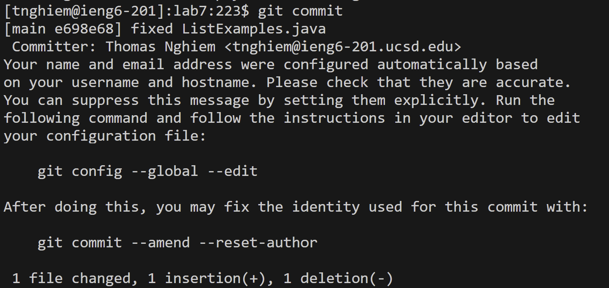
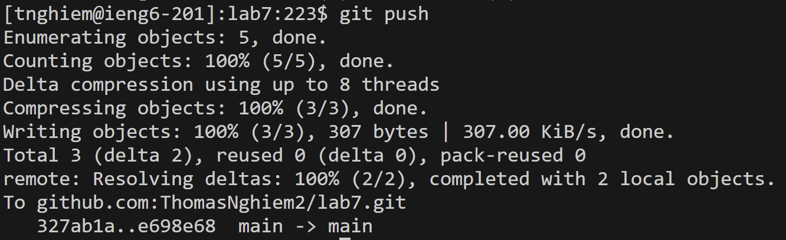

## Step 1
  
Keys Pressed: Typed out `ssh tnghiem@ieng6.ucsd.edu <enter>` to log in.

## Step 2
  
Keys Pressed: Typed out `git clone <ctrl-v><enter>` after doing `<ctrl-c>` on the `SSH` url.

## Step 3
  
Keys Pressed: Typed out `cd <space> l <tab><enter>` to change into the `lab7` directory, then `bash t <tab><enter>` to run `test.sh`.

## Step 4
  
Keys Pressed: Typed out `vim L <tab> . <tab> <enter>` to start editing the `ListExamples.java` file. Then, `/index1 <enter>` to search file, `<shift-n>` to go to the end, `e` to move to the end of the word, and `r2` to replace the `1` with a `2`. Finally, `:wq <enter>` to save and exit the file.

## Step 5
  
Keys Pressed: `<up><up><enter>`, the `bash test.sh` command was 2 up in the command history, so I used the up arrow to access it. 

## Step 6
  
  
Keys Pressed: Typed out `git add L <tab><enter>` to stage the edited file, `ListExamples.java` for commit. Then, typed out `git commit`, where I did `i` to get into insert mode to type my message. After typing the message, I did `<esc> :wq` to exit insert mode and save and quit. Finally, typed out `git push` to push it to Github.
