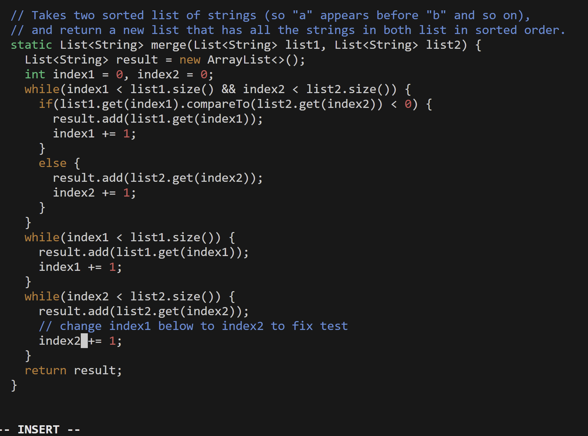

## Step 1
  
Keys Pressed: Typed out `ssh tnghiem@ieng6.ucsd.edu` to log in.

## Step 2
  
Keys Pressed: Typed out `git clone <ctrl-v><enter>` after doing `<ctrl-c>` on the `SSH` url.

## Step 3
  
Keys Pressed: Typed out `cd <space> l <tab><enter>` to change into the `lab7` directory, then `bash t <tab><enter>` to run `test.sh`.

## Step 4
  
Keys Pressed: Typed out `vim L <tab> . <tab> <enter>` to start editing the `ListExamples.java` file. Then, `/ index1 <enter>` to search file, `<shift-n>` to go to the end, `e` to move to the end of the word, and `r2` to replace the `1` with a `2`. Finally, `:wq <enter>` to save and exit the file.

## Step 5
  
Keys Pressed:
